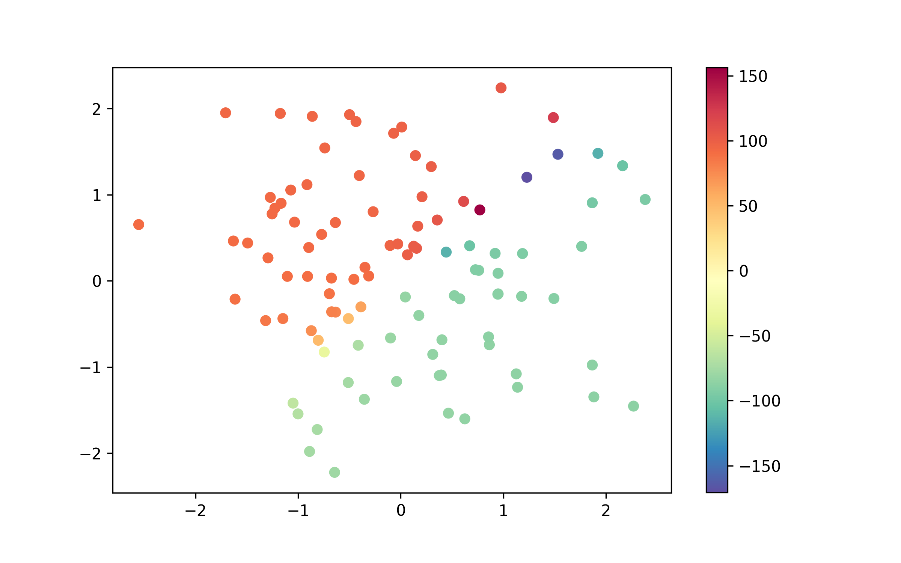
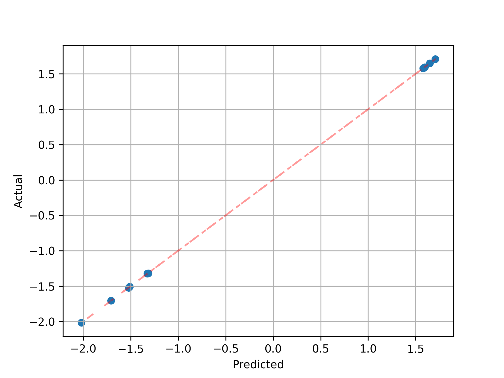

# angle-pred

In this repository, I'm going to explore and compare the performance of various techniques for continuous orientation estimation tasks, where the goal is to take an input and spit out an angular value between 0 and 360 degrees.

## Data Generation

The 2D training points `X` are sampled from a standard normal distribution. The `sin` and `cos` values are created through a random linear combination of the columns of `X` which are then fed through the `arctan2` method to create the ground truth angle values in the range `[-π, +π]`.

 

## Model Architecture

We use a simple MLP with 2 hidden layers of size 4. The network is trained using Adam with a learning rate of `1e-3`. 

## Experiment No. 1

**Idea.** Have the network spit out 2 values coresponding to `sin` and `cos`. Transform that to angle values using `arctan2` and train with MSE.

**Results.** 

* train mean absolute error: `0.004`
* test mean absolute error: `1.639`

 

